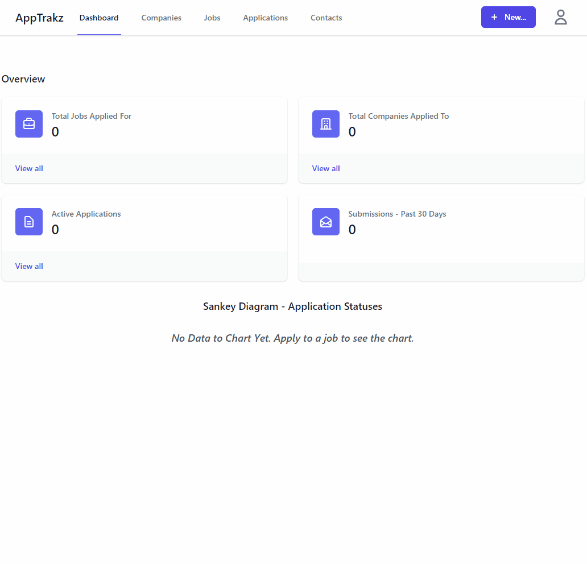
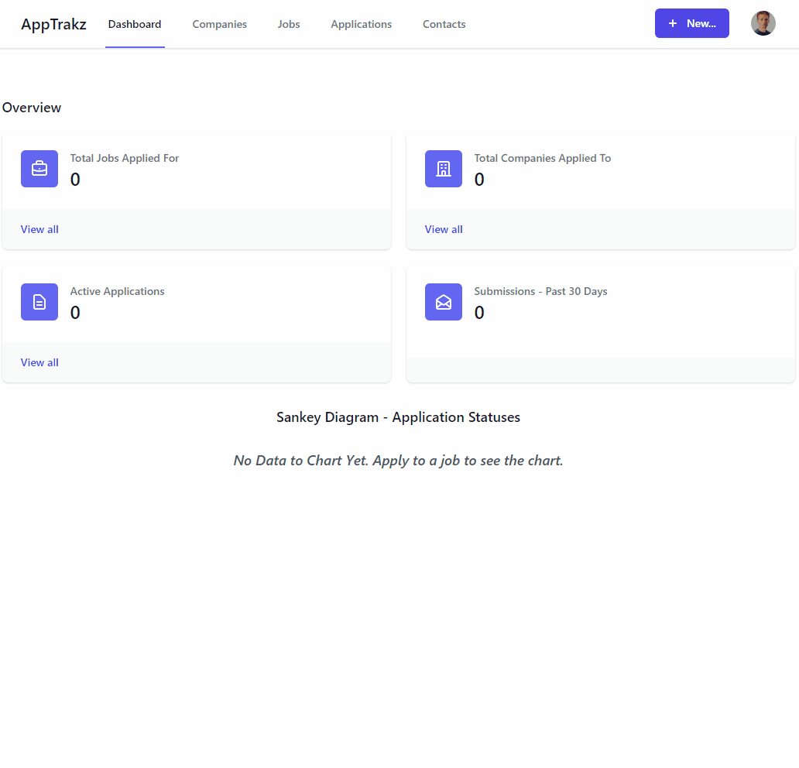
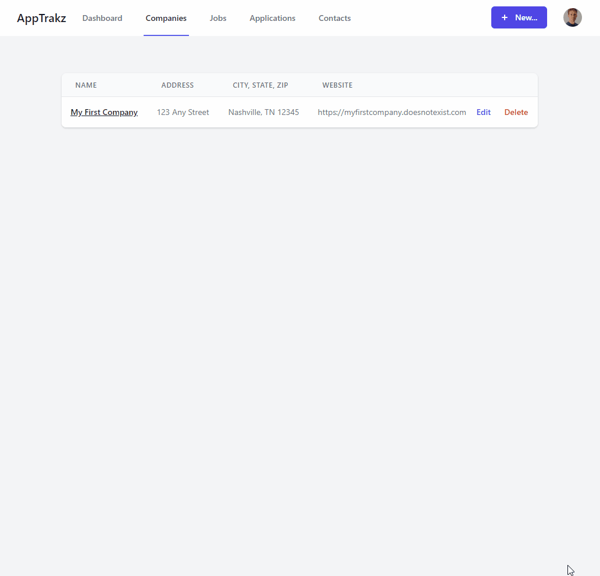
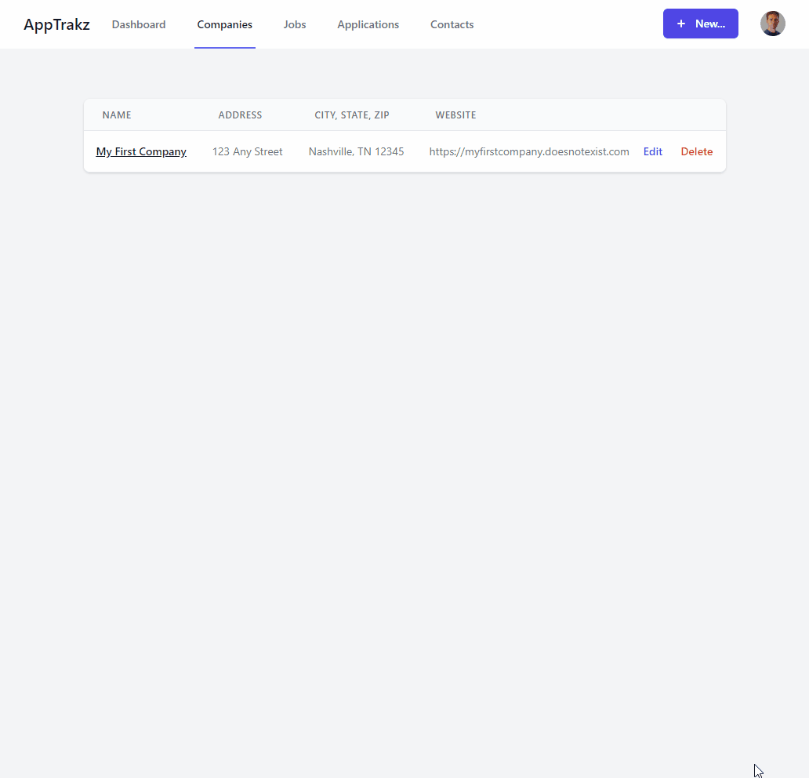
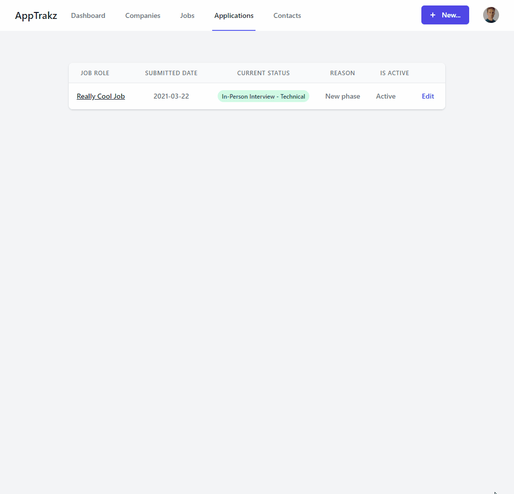
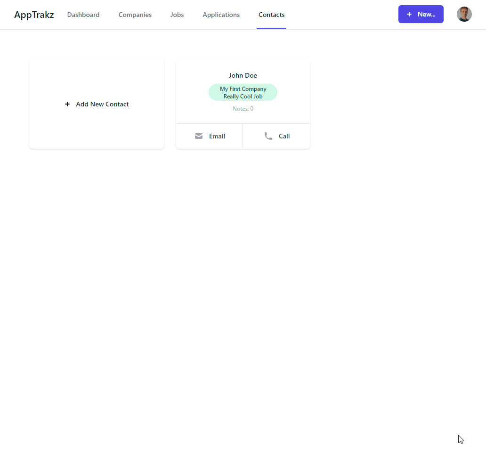

# AppTrakz

This is my back-end capstone project that I created while participating in the [Nashville Software School - Full Stack Web Developer Python/Django](http://nashvillesoftwareschool.com) bootcamp.

The goal of this project was to build an application which helps document and track job applications for users during their job search process.

This idea was originally spawned from my own need to track job applications, but the need for it was further reinforced when a discussion thread popped up in one of the NSS slack channels about tracking applications. The response there was to provide users a Google Docs spreadsheet to track those applications.

This is when I figured that there was a greater need for a tool to support this idea and since we're all aspiring software developers, why not "make an app for that"? 

## Screenshots

### Login and Registration

### Profile Update

### Creating a New Company and Job Record

### Edit Company Details

### Edit Job Details

### Update Application Timeline

### Contacts

### Dashboard

## Deployed Project
[Deployed Project](https://apptrakz-client.herokuapp.com/)
## Technologies Used

 
 

